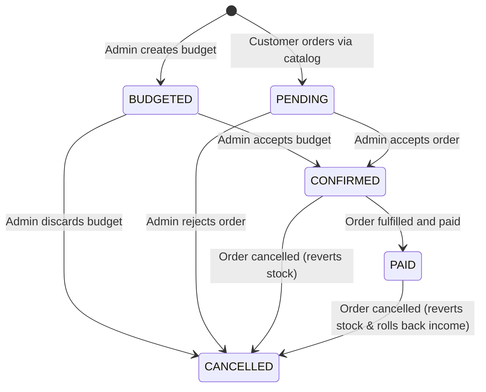

# Neon Nova - Technical & Business Requirements Specification

## 1. System Overview & Architecture

* **System Type:** Single Page Application (SPA) for Business Management & SaaS MVP.
* **Target User:** 3D Printing & LED Neon Sign Workshop Operator (Internal Dogfooding Phase).

### Technology Stack
* **Frontend:** React + Vite + TypeScript
* **Routing:** TanStack Router (`@tanstack/react-router`)
* **Async State & Data Fetching:** TanStack Query (`@tanstack/react-query`)
* **Tables & Data Grids:** TanStack Table (`@tanstack/react-table`)
* **Styling:** Tailwind CSS + shadcn/ui
* **Database & Auth (Phase 1):** Supabase (PostgreSQL)

---

## 2. Domain Data Models & TypeScript Types

```typescript
export type OrderStatus = 'BUDGETED' | 'PENDING' | 'CONFIRMED' | 'PAID' | 'CANCELLED';

export type TransactionType = 'INCOME' | 'EXPENSE';

export type TransactionCategory = 
  | 'Venta Presencial'
  | 'Mercado Libre'
  | 'Instagram'
  | 'Insumos'
  | 'Servicios'
  | 'Otros';

export interface PrintComponent {
  id?: string;
  name: string; // e.g., "Caja / Base", "Tapa / Difusor"
  filament_id: string;
  grams_required: number;
  print_time_hours: number;
}

export interface SupplyComponent {
  supply_id: string;
  quantity_required: number;
}

export interface Product {
  id: string;
  name: string;
  description: string;
  category_id: string;
  stock_quantity: number;
  min_stock_alert: number;
  unit_cost: number;
  sale_price: number;
  tags: string[];
  components?: PrintComponent[]; // Multi-piece support
  supplies?: SupplyComponent[];   // Associated hardware/insumos
  created_at: string;
  updated_at: string;
}

export interface Supply {
  id: string;
  name: string; // e.g., "Vaso Aluminio 700ML", "Cianoacrilato", "Imán Neodimio 5x2mm"
  unit_cost: number;
  stock_quantity: number;
  unit_of_measure: 'unit' | 'ml' | 'grams';
  created_at: string;
}

export interface Filament {
  id: string;
  brand: string;
  type: string; // e.g., "PLA", "PETG", "ABS"
  color: string;
  cost_per_gram: number;
  stock_grams: number;
  created_at: string;
}

export interface OrderItem {
  id: string;
  order_id: string;
  product_id?: string; // Optional: Null if custom ad-hoc item
  item_name: string;
  quantity: number;
  unit_cost: number;
  unit_sale_price: number;
  calculation_snapshot?: {
    components: PrintComponent[];
    supplies: SupplyComponent[];
    energy_cost: number;
    wear_cost: number;
    labor_cost: number;
    profit_margin: number;
  };
}

export interface Order {
  id: string;
  customer_name: string;
  customer_phone: string;
  customer_notes?: string;
  status: OrderStatus;
  total_cost: number;
  total_price: number; // Configurable / Manual Override
  created_at: string;
  updated_at: string;
  items: OrderItem[];
}

export interface FinancialTransaction {
  id: string;
  type: TransactionType;
  amount: number;
  category: TransactionCategory;
  description: string;
  date: string; // ISO Timestamp
  order_id?: string; // Nullable: Links to Order if generated automatically
  created_at: string;
}

```

---

## 3. Core Feature Workflows

### 3.1 Order Lifecycle & State Machine

#### Status Definitions
* **`BUDGETED`**: Internal price estimation created by Admin. Stock is **not** reserved.
* **`PENDING`**: External order initiated by Customer via public catalog. Awaiting Admin confirmation. Stock is **not** reserved.
* **`CONFIRMED`**: Order approved by Admin (via WhatsApp inquiry or direct validation). Reserves product, filament, and supply stock.
* **`PAID`**: Order fulfilled and paid in full. Triggers automatic income entry in Financial Transactions.
* **`CANCELLED`**: Order discarded. Reverts stock deduction if it was previously in `CONFIRMED` or `PAID` state.

#### State Transitions Matrix
* `BUDGETED` &rarr; `CONFIRMED` | `CANCELLED`
* `PENDING` &rarr; `CONFIRMED` | `CANCELLED`
* `CONFIRMED` &rarr; `PAID` | `CANCELLED` (Reverts stock allocation)
* `PAID` &rarr; `CANCELLED` (Triggers rollback for both financial income record and stock allocation)



#### Workflow A: Admin Order / Budget Creation
1. **Order Initiation:** Admin enters Order Creation form.
2. **Item Selection:** Admin selects items from Product Catalog OR uses integrated 3D/LED Calculator to define custom line items (with 1 or $N$ pieces/components).
3. **Price Calculation:** System sums calculated costs and suggests total price. Admin can manually edit final total price.
4. **Save Budget:** Order is saved with status = `BUDGETED`.
5. **Share Quote:** Admin copies formatted WhatsApp quote message to send to customer.
6. **Confirmation:** When customer accepts, Admin changes status to `CONFIRMED`.

#### Workflow B: Customer Public Catalog Order
1. **Access Catalog:** Customer accesses public catalog route (`/public/catalog`).
2. **Cart Management:** Customer adds catalog products to cart.
3. **Checkout Details:** Customer fills checkout drawer (Name, Phone, Notes).
4. **Order Creation:** System creates Order record in database with status = `PENDING`.
5. **WhatsApp Redirection:** System redirects customer to WhatsApp with pre-filled message payload.
6. **Dashboard Review:** Order appears in Admin Dashboard under "Pending Review".
7. **Admin Confirmation:** Admin verifies down-payment or order validity and transitions status to `CONFIRMED`.

---

### 3.2 Integrated Calculator Logic (Multi-Component Support)

Calculations are executed in real-time within the Order Creation UI and Product Creation UI.

#### 3D Printing Formulas (Per Piece Component)
For each component $i$ in a project:

$$\text{Component Material Cost}_i = \text{Grams}_i \times \text{Filament Cost per Gram}_i$$

$$\text{Total Material Cost} = \sum_{i=1}^{n} \text{Component Material Cost}_i$$

$$\text{Total Print Hours} = \sum_{i=1}^{n} \text{Print Time Hours}_i$$

$$\text{Energy Cost} = \text{Total Print Hours} \times \text{Power Consumption (kW)} \times \text{Electricity Rate per kWh}$$

$$\text{Machine Wear Cost} = \text{Total Print Hours} \times \text{Hourly Wear Rate}$$

$$\text{Supplies Cost} = \sum_{j=1}^{m} (\text{Quantity}_j \times \text{Supply Unit Cost}_j)$$

$$\text{Total Production Cost} = \text{Total Material Cost} + \text{Energy Cost} + \text{Machine Wear Cost} + \text{Supplies Cost}$$

$$\text{Recommended Sale Price} = \text{Total Production Cost} \times \text{Profit Multiplier}$$

#### LED Neon Frame Formulas

$$\text{Frame Base Cost} = \text{Width (m)} \times \text{Height (m)} \times \text{Base Material Cost per m}^2$$

$$\text{LED Strip Cost} = \text{Meters Used} \times \text{Cost per Meter}$$

$$\text{Total Production Cost} = \text{Frame Base Cost} + \text{LED Strip Cost} + \text{Power Supply Unit Cost} + \text{Assembly Time Cost}$$

$$\text{Recommended Sale Price} = \text{Total Production Cost} \times \text{Profit Multiplier}$$

---

### 3.3 Inventory & Multi-Stock Deduction Rules

1. **Stock Deduction Event:** Triggered immediately when an order transitions to `CONFIRMED`.
2. **Stock Deduction Execution Logic:**
   * **For Catalog Products:** Decrement `Product.stock_quantity` by ordered quantity.
   * **For Components / Specs:**
     * Iterate through `components` array and decrement `Filament.stock_grams` by $\text{grams\_required} \times \text{order\_item\_quantity}$.
     * Iterate through `supplies` array and decrement `Supply.stock_quantity` by $\text{quantity\_required} \times \text{order\_item\_quantity}$.
3. **Low Stock Alerting:**
   * Flag products when `stock_quantity <= min_stock_alert`.
   * Flag filaments/supplies when stock levels fall below global threshold.

---

### 3.4 Finance & Sales Module

#### Automated Income Logging
When an Order status transitions to `PAID`:
* System automatically creates a row in `financial_transactions`:
  * `type` = `'INCOME'`
  * `amount` = Order `total_price`
  * `category` = `'Venta Presencial'` (or specified sales channel)
  * `description` = `"Pago Pedido #<order_id> - Customer: <customer_name>"`
  * `order_id` = Order ID

#### Manual Financial Logging
* Admin can manually create income/expense records without linked orders.
* Required fields: `type` (`INCOME`/`EXPENSE`), `amount`, `category`, `description`, `date`.

---

### 3.5 Dashboard & Statistics Requirements

UI Design Pattern: Dashboard layout based on reference specs (Header KPIs, main chart, monthly data table).

#### Metrics Calculations
* **Monthly Revenue:** Sum of `amount` where `type = INCOME` in target month.
* **Monthly Expenses:** Sum of `amount` where `type = EXPENSE` in target month.
* **Monthly Net Gain:**
  $$\text{Monthly Net Gain} = \text{Monthly Revenue} - \text{Monthly Expenses}$$
* **Month-over-Month Comparison:**
  $$\text{MoM \%} = \frac{\text{Current Month Net Gain} - \text{Previous Month Net Gain}}{\text{Previous Month Net Gain}} \times 100$$

#### Chart Component
* 6-Month Historical Bar Chart comparing `INCOME` vs `EXPENSE` per month.

#### Monthly Breakdown Table
* Columns: Month, Income, Expenses, Net Gain.
* Sorted chronologically descending.

---

## 4. Route Map Strategy (SPA Architecture)

```text
/
├── /dashboard               -> KPI Overview, 6-Month Chart, Quick Metrics
├── /orders                  -> Orders Management Table (Filterable by OrderStatus)
│   ├── /orders/new          -> Order Builder UI with Integrated Multi-Piece Calculator
│   └── /orders/:id          -> Order Detail & State Transition Actions
├── /catalog                 -> Admin Catalog Management (CRUD + Stock)
├── /supplies                -> Filaments & Hardware Insumos Inventory Management
├── /finances                -> Sales & Expenses Ledger + Manual Transaction Modal
├── /statistics              -> Advanced Monthly Analytics & Financial Reports
└── /public/catalog          -> Customer Public Catalog View & WhatsApp Checkout
```